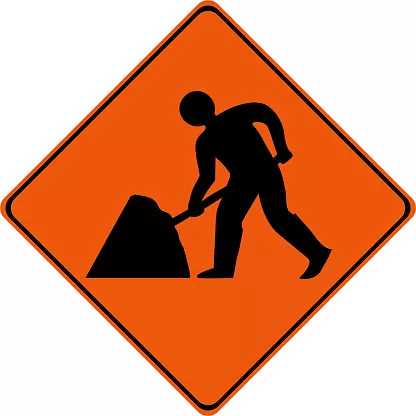

# VOgorode

> ##### Сервис "VOgorode"
>   
> Проект представляет из себя систему предоставляющую сервис по проведению ландшафтных работ клиентам распределённым
> географически. Сервис должен подбирать исполнителей на основании географических координат исполнителя и локации заказчика,
> списка оказываемых исполнителем работ, а так же рейтинга исполнителя.
> - HandymanService - бэк для клиентской части, обслуживающий людей которые предоставляют сервис.
    > есть набор характеристик - что умеет (копать, сажать картошку, поливать грядки), где находится,
    > зафиксированное расписание, оплата за час.
> - RancherService - бэк обслуживающий участки, координаты, размеры поля, список требуемых работы и т.п.
> - LandscapeService - Управление пользователями, назначение на работы, управление ценой за работы,
    > проставление рейтинга, сбор статистики.

##### *[как запустить приложение](./dev/README.md)*

---

# HW1
### [Проделанная работа](./docs/HW1.md)

---

# HW2
### [Проделанная работа](./docs/HW2.md)

---

# HW3
### [Проделанная работа](./docs/HW3.md)

---

# HW4
### [Проделанная работа](./docs/HW4.md)

---

# HW5
### [Проделанная работа](./docs/HW5.md)

---

# HW6
### [Проделанная работа](./docs/HW6.md)

---

# HW7
### [Проделанная работа](./docs/HW7.md)

---

# HW8
### [Проделанная работа](./docs/)

---