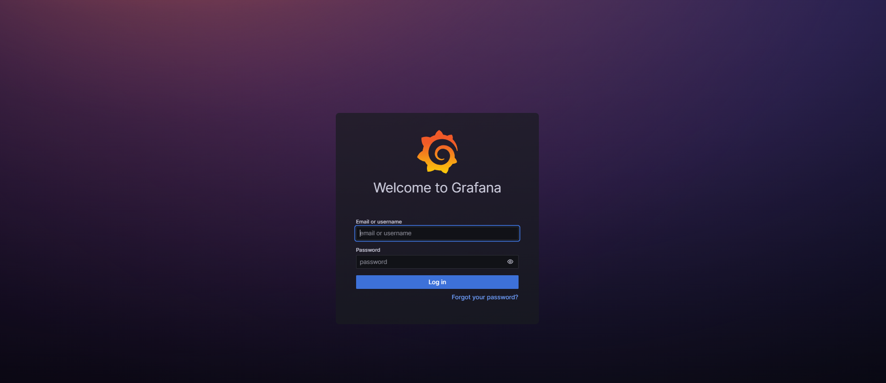
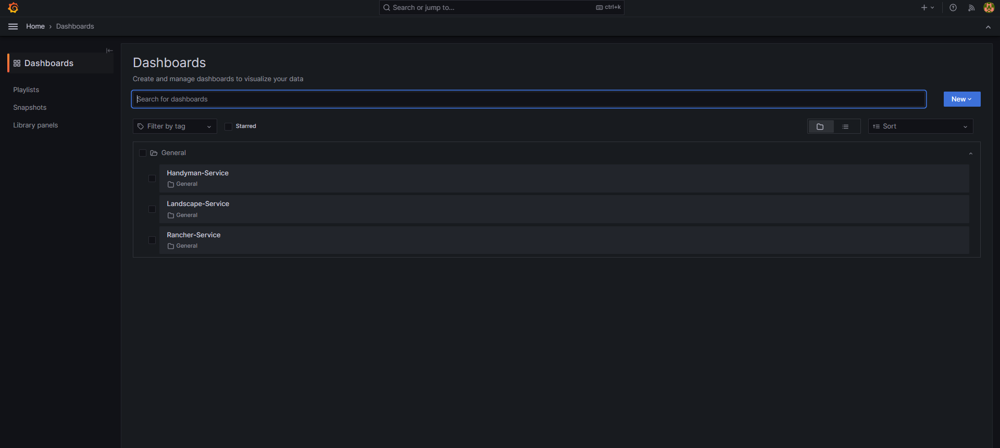
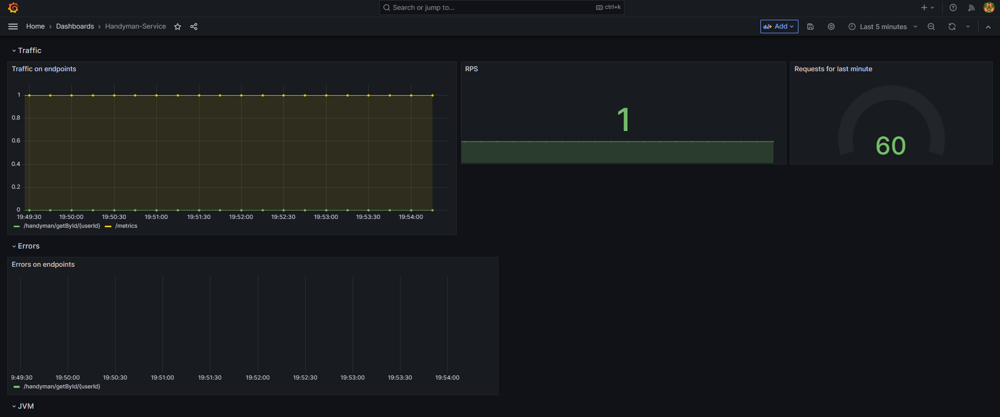

# Сборка проекта

---

### 1. Сборка сервисов

Сходим во все проектные директории проекта и соберем их при помощи **gradle** - для этого воспользуемся командами `cd` и `gradlew bootJar` :
 - *HandymanService*
```bash
    cd HandymanService && gradlew bootJar && cd ..
```
 - *LandscapeService*
```bash
    cd LandscapeService && gradlew bootJar && cd ..
```
 - *RancherService*
```bash
    cd RancherService && gradlew bootJar && cd ..
```


---

### 2. Сборка контейнеров

Здесь нам понадобится **docker**.

Чтобы собрать контейнеры выполним команду `docker-compose build` в **/dev** директории:
```bash
    cd dev && docker-compose build && cd ..
```


Далее запустим контейнеры при помощи команды `docker-compose up` 
```bash
    cd dev && docker-compose up && cd ..
```


Ура! - приложение запущено.

### 3. Потыкаем приложение

Зайдем в наш любимый браузер и убедимся что наши сервисы рабоают:
- *LandscapeService* - сходим по адресу *<localhost:8080/system/readiness>*


Ура! LandscapeSevice на лету

- *HandymanService* и *RancherService* - сходим по адресу *<localhost:8080/system/conections>*


Победа! Наши сервисы рабоют

Теперь посмотрим на метрики - grafana и prometheus:
- *grafana* - перейдем по *<localhost:3000>*


- *prometheus* - *<localhost:9090>*


---

# Инструкция по поднятию Prometheus + Grafana

### 0. Используем прыдущую инструкцию для сборки проекта

### 1. Запускаем контейнер
Для начала надо попасть в коренную папку проекта.

Далее запустить контейнеры при помощи команды `docker-compose up`
```bash
    cd dev && docker-compose up && cd ..
```

### 2. Пользуемся

2.0 Посмотрим на метрики - grafana и prometheus:
- *grafana* - перейдем по *<localhost:3000>*

2.1 Авторизуемся - логин и пароль в файле _docker-compose.yml_ (по умолчанию login: **admin**, password: **admin**)



2.2 После входа идем в Dashboards


2.3 Выбираем понравившийся dashboard



2.4 Наши метрики


